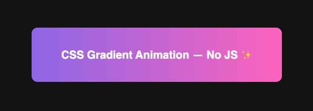

# CSS Gradient Animation - Day 3

A beautiful animated gradient box created with pure CSS - no JavaScript required! This project demonstrates how to create smooth, flowing gradient animations using CSS keyframes and background positioning.

## 🎨 Features

- **Pure CSS Animation** - No JavaScript dependencies
- **Smooth Gradient Flow** - Animated gradient transitions across multiple colors
- **Responsive Design** - Centered layout that works on all screen sizes
- **Minimal Code** - Clean and easy to understand implementation

## 🖼️ Screenshot

## 🎥 Video Demo

Watch the full tutorial and demo on TikTok:
[CSS Gradient Animation Tutorial](https://www.tiktok.com/@codingsolutionsbyusman/video/7572694652109835536?is_from_webapp=1&sender_device=pc&web_id=7571180243643647495)

## 🚀 How It Works

The animation uses:
- `linear-gradient()` with multiple color stops
- `background-size: 400% 400%` to create a large gradient area
- CSS `@keyframes` to animate the `background-position`
- 6-second infinite loop for smooth continuous animation

## 💻 Usage

Simply open `index.html` in any modern web browser to see the animation in action.

---

## 👨‍💻 Author

**Usman**  
*FullStack Engineer*

### 💼 Hire Me

I'm available for freelance projects and full-time opportunities!

📧 **Email:** musmannadeem92@gmail.com  
📱 **Mobile:** +923065918097  
🌐 **Website:** [usmannadeem.com](https://usmannadeem.com)

---

*Follow me on TikTok [@codingsolutionsbyusman](https://www.tiktok.com/@codingsolutionsbyusman) for more coding tips and tutorials!*
