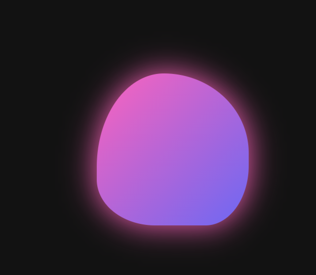

# CSS Morphing Blob Animation - Day 4

A mesmerizing morphing blob animation created with pure CSS - no JavaScript required! This project demonstrates how to create organic, fluid shape transformations using CSS keyframes and border-radius animations.

## 🎨 Features

- **Pure CSS Animation** - No JavaScript dependencies
- **Organic Morphing** - Smooth shape transformations with multiple keyframes
- **Gradient Background** - Beautiful pink to purple gradient
- **Glow Effect** - Drop shadow filter for enhanced visual appeal
- **Responsive Design** - Centered layout that works on all screen sizes

## 🖼️ Screenshot

## 🎥 Video Demo

Watch the full demo on TikTok:
[CSS Morphing Blob](https://www.tiktok.com/@codingsolutionsbyusman/video/7573420682097282325?is_from_webapp=1&sender_device=pc&web_id=7571180243643647495)

## 🚀 How It Works

The animation uses:
- `border-radius` with percentage values for organic shapes
- CSS `@keyframes` with multiple stages (0%, 25%, 50%, 75%, 100%)
- `transform: translate()` for subtle movement
- `filter: drop-shadow()` for the glowing effect
- 8-second infinite loop for continuous morphing

## 💻 Usage

Simply open `index.html` in any modern web browser to see the morphing blob animation in action.

---

## 👨‍💻 Author

**Usman**  
*FullStack Engineer*

### 💼 Hire Me

I'm available for freelance projects and full-time opportunities!

📧 **Email:** musmannadeem92@gmail.com  
📱 **Mobile:** +923065918097  
🌐 **Website:** [usmannadeem.com](https://usmannadeem.com)

---

*Follow me on TikTok [@codingsolutionsbyusman](https://www.tiktok.com/@codingsolutionsbyusman) for more coding tips and tutorials!*