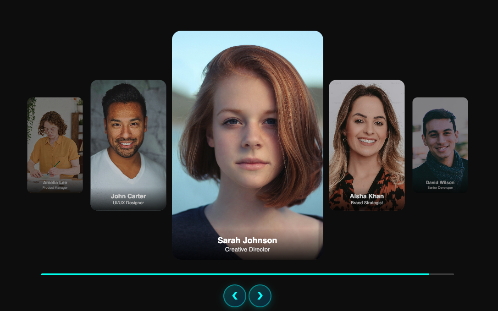

# 3D Team Carousel Slider - Day 21

A modern, interactive 3D carousel slider showcasing team members with smooth animations, auto-sliding, progress bar, and glassmorphism design - powered by pure CSS and JavaScript!

## 🎨 Features

- **3D Carousel Effect** - Multi-layered card positioning with depth
- **5-Card Layout** - Center card with 2 cards on each side at different scales
- **Auto-Slide Animation** - Automatic rotation every 3 seconds
- **Progress Bar** - Visual indicator for auto-slide timing
- **Navigation Controls** - Left/right buttons with glassmorphism design
- **Smooth Transitions** - 0.6s ease animations between slides
- **Team Member Cards** - Profile images with name and role overlay
- **Responsive Design** - Adapts beautifully to all screen sizes
- **Interactive Hover Effects** - Enhanced button states with glow

## 🖼️ Screenshot



## 🎥 Video Demo

Watch demo on TikTok:
[3D Carousel Tutorial](https://www.tiktok.com/@codingsolutionsbyusman/video/7581223717657693448?is_from_webapp=1&sender_device=pc&web_id=7571180243643647495)

## 🚀 How It Works

The carousel uses:
- **Position Absolute** - Cards positioned in 3D space
- **Transform Effects** - `translateX()` and `scale()` for depth perception
- **Opacity Control** - Fading effect for distant cards
- **JavaScript Logic** - Modular arithmetic for circular navigation
- **Progress Animation** - CSS transition for smooth loading bar
- **Auto-Advance Timer** - `setInterval` for automatic sliding

## 💻 Usage

Simply open `index.html` in any modern web browser to see the carousel:

- **Auto-Sliding**: Cards automatically rotate every 3 seconds
- **Manual Navigation**: Click left/right arrows to navigate
- **Progress Bar**: Shows time remaining until next auto-slide
- **Smooth Transitions**: Professional animations between cards

## 🗂️ File Structure

```
7Dec25/
├── index.html      # HTML structure with team member cards
├── style.css       # Complete carousel styling and animations
├── script.js       # JavaScript for carousel logic and auto-slide
└── readme.md       # This documentation
```

## 🎨 Design Elements

### **Carousel Layout:**
- **Center Card** - 330x500px, full opacity, scale 1
- **Adjacent Cards** - 220x380px, 80% opacity, scale 0.75, ±260px offset
- **Distant Cards** - 220x380px, 50% opacity, scale 0.55, ±420px offset

### **Visual Effects:**
- **Dark Background** - `#0a0a0a` for modern look
- **Glassmorphism** - Backdrop blur on buttons and info overlay
- **Gradient Overlay** - Bottom gradient for name/role display
- **Cyan Accents** - `#00ffff` for progress bar and button highlights
- **Shadow Effects** - Layered shadows for depth and glow

### **Interactive Elements:**
- **Navigation Buttons** - 50x50px circular buttons with gradient
- **Hover Effects** - Lift and scale with enhanced glow
- **Active States** - Pressed effect for better feedback
- **Progress Bar** - 4px height with cyan fill animation

### **Team Members:**
- Sarah Johnson - Creative Director
- Aisha Khan - Brand Strategist
- David Wilson - Senior Developer
- Amelia Lee - Product Manager
- John Carter - UI/UX Designer

## 🔧 Technical Highlights

### **JavaScript Features:**
- **Circular Navigation** - Modular arithmetic for infinite loop
- **Class Management** - Dynamic class assignment for positioning
- **Progress Reset** - Smooth restart of loading bar animation
- **Timer Management** - Auto-slide with 3-second intervals
- **Event Listeners** - Button click handlers for manual control

### **CSS Animations:**
- **Card Transitions** - 0.6s ease for all transform changes
- **Button Hover** - 0.3s all properties transition
- **Progress Bar** - 3s linear width animation
- **Transform Origin** - Center-based scaling for natural effect

---

## 👨‍💻 Author

**Usman**
*FullStack Engineer*

### 💼 Hire Me

I'm available for freelance projects and full-time opportunities!

📧 **Email:** musmannadeem92@gmail.com
📱 **Mobile:** +923065918097
🌐 **Website:** [usmannadeem.com](https://usmannadeem.com)
📷 **Instagram:** [@codingsolutionsbyusman](https://www.instagram.com/codingsolutionsbyusman/)
📺 **YouTube:** [@CodingSolutionsbyUsman](https://www.youtube.com/@CodingSolutionsbyUsman)

---

*Follow me on TikTok [@codingsolutionsbyusman](https://www.tiktok.com/@codingsolutionsbyusman) for more coding tips and tutorials!*
